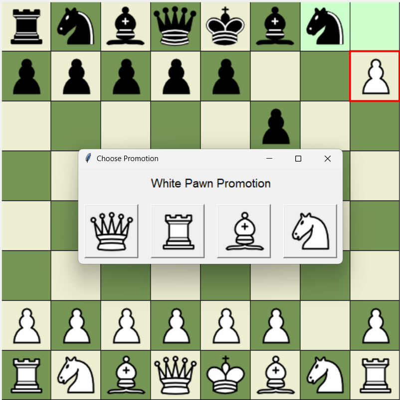
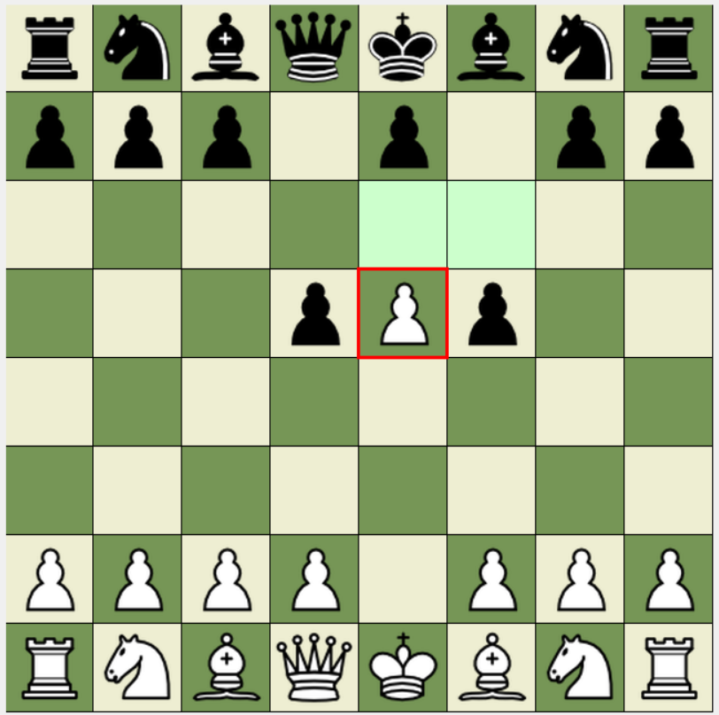
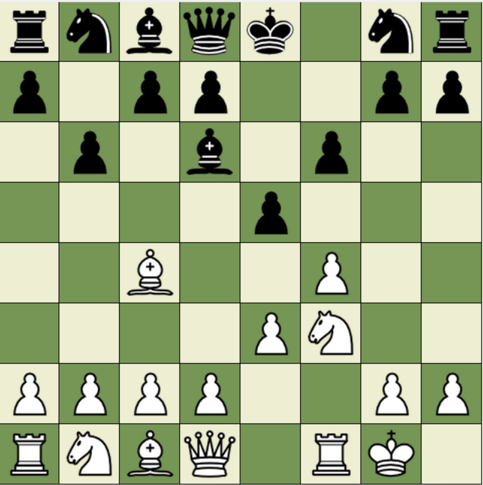

\# ♟️ Python Chess Game


A full-fledged, object-oriented Chess game built using Python with a graphical user interface (GUI) and complete rule implementation including:


\- Castling

\- En Passant

\- Pawn Promotion

\- Check, Checkmate \& Stalemate

\- Threefold Repetition Draw


This project was built for learning, fun, and to demonstrate how chess logic can be cleanly implemented using Python.


\## 🖥️ Features


\- Full chess rules (FIDE standard)

\- Turn-based movement

\- GUI with drag-and-drop or click-to-move

\- Move history

\- Piece icons

\- Castling \& En passant

\- Draw by threefold repetition detection

\- Pawn promotion

\- Game end detection: checkmate, stalemate, draw


\## 📸 Screenshots


### ♟️ Pawn Promotion


### ⚔️ En Passant Capture


### 🏰 Castling Move



\## 🛠️ Tech Stack


\- \*\*Python 3.9+\*\*

\- \*\*Tkinter\*\* – for GUI

\- \*\*OOP Principles\*\* – every piece is its own class

\- \*\*Modular structure\*\* – code is organized cleanly across files


\## 📂 Folder Structure


```

chess\_game/

├── gui/

│   └── gui.py

├── logic/

│   ├── board.py

│   ├── game.py

│   ├── piece.py

│   

├── assets/

│   └── \*.png (piece icons)

├── main.py

├── README.md

└── requirements.txt

```


\## ▶️ How to Run


1\. \*\*Clone the repo:\*\*


```bash

git clone https://github.com/your-username/python-chess-game.git

cd python-chess-game

```


2\. \*\*Install dependencies (optional)\*\*


Tkinter is usually included with Python. Otherwise:


```bash

sudo apt-get install python3-tk  # Linux

```


3\. \*\*Run the game:\*\*


```bash

python main.py

```


\## 📦 Optional Features to Add


\- Timer / Clock for each player

\- Multiplayer support

\- AI opponent

\- PGN Export / Save Game


\## 📜 License


MIT License – see \[LICENSE](LICENSE) for details.


\## 🙌 Acknowledgements


Thanks to open-source icons and the Python community.


---


Made with ❤️ by Harsh Pathak

